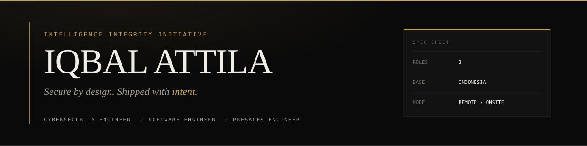

---

### NOW

| | |
|---|---|
| `working`  | Hermes Agent extensions, Omarchy contributions, IA branding deliverables |
| `learning` | DSPy programs, Axolotl fine-tuning, Polymarket data pipelines |
| `stack`    | TypeScript · Python · Bash · Astro · Tailwind |
| `tools`    | Arch + Hyprland · Neovim · gh · Claude Code |

---

### SERVICES

| | |
|---|---|
| `dev`      | Production code. TypeScript / Python / Astro. Internal tools, automation, integrations. |
| `presales` | Technical sales support. Demo systems, RFP responses, solution architecture. |
| `security` | Penetration testing, security audits, hardening reviews. |

Short engagements preferred. Indonesia and remote.

---

### CONTACT

| | |
|---|---|
| `web`  | [kcmon.id](https://kcmon.id) |
| `mail` | iqbal@kcmon.id |

---

Intelligence Integrity Initiative — © Iqbal Attila
